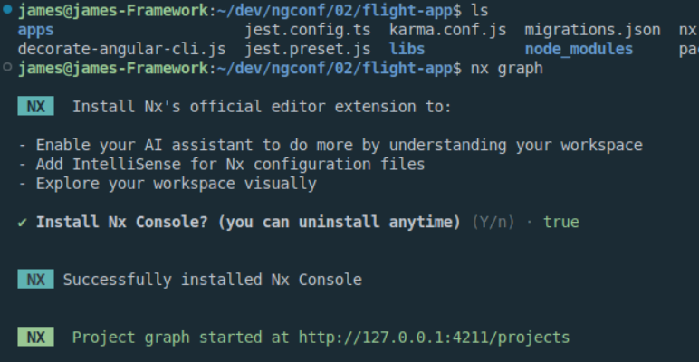
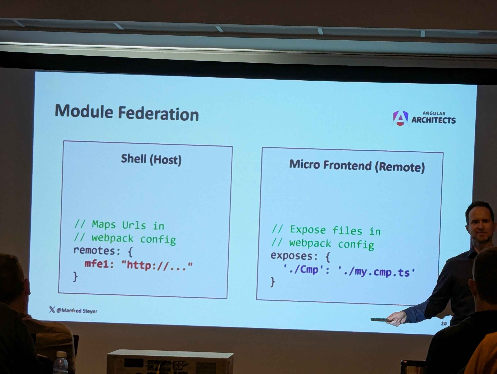
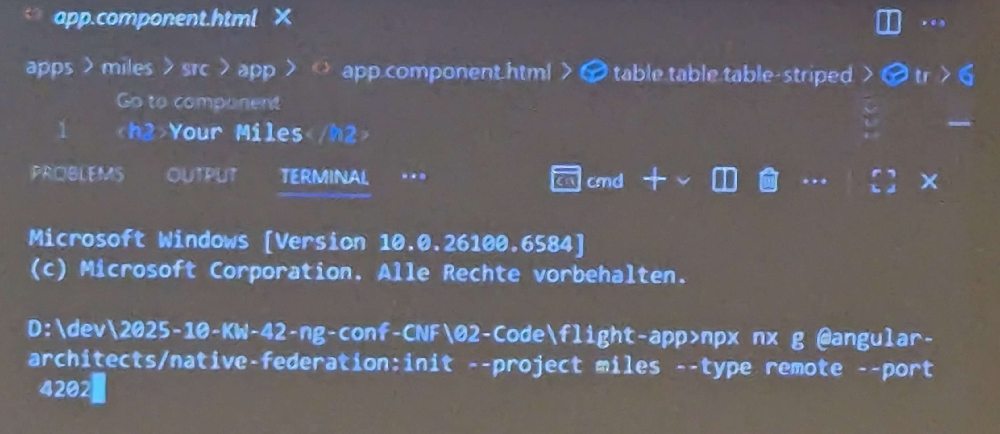
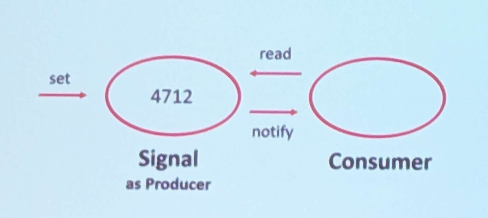

*NOTE: if cloning this notes file, make sure you also clone the **resources** directory in the same location to be able to view linked images* 
<hr>
Thursday: **Angular Architecture Workshop** 

Manfred Steyer: [angulararchitects.io](angulararchitects.io)<br>
Michael Egger-Zikes: [angulararchitects.io](angulararchitects.io)

**[Github Exercise Repo](https://github.com/angular-architects/flight-app/branches)** <br>
**[Slides and Workshop Instructions](https://workshops.angulararchitects.io/ms/c0f5d43e-cd8d-4d0f-82b7-c2ba9225b7a3/index.html)**

<details open>
<summary>
Morning: Architecture and Microfrontends
</summary>

# How to Structure an Architecture 

## Vertical Architectures 
- Split architecture into parts that don't need to know much about eachother
- Each stack contains features, but minimal dependencies between the others
  - DDD would call them bounded contexts
  - "Business Domains" 
  - Domain Driven Design looks a lot at semantics to decide what belongs where
    - If terms are used the same way in multiple areas, they might belong in the same vertical 
  - Conway's Law: Organization of your software is a mirror of the way that the software is written 
    - Organization -> Architecture in modern verbiage
    - Organize your teams in the same way that you want the architecture to look like 

## Structure
Split into...
- Feature Layer
  - Smart components that know how to fulfill a given goal
  - Not super reusable since they have to perform specific tasks
- UI Layer
  - Components that are "dumb components"
- Domain Layer (model)
  - Interacts with database
- Utility Layer 

Provides order to the system (such as only navigating top down in the hierarchy above)

 ## Nx
Smart repositories and fast builds. Organize a repository by splitting it into different paths that can be maintained on their own 

- Organizes repos and projects around libraries
  - In Nx, a library is both for reuse and structure
  - Therefore, lots of libraries when using it
  - Each cell in the hierarchy above under ## Structure becomes a library
- Module Boundaries
- Build Cache
- Dependency Graph

```nx graph```


## Sheriff

- Same idea as Nx, but fewer filesystem structural changes that Nx makes
- ESLinting rule
- Works with Nx and Ng

"Sister" project called **Detective**
- Visualize architecture on a folder level 

# Micro Frontends with Federation
- Slice one big system into verticals, same idea
- Big difference is that each of those verticals becomes an app of its own
  - One developer team per one domain/app


*A microfrontend is just splitting your vertical domains into their own apps*

## Module Federation
- Shell (Host)
- Micro Frontend (Remote)
  - Loaded into the shell overtime


*How do these apps talk to each other?*

Build tools becoming popular (alongside webpack)
- esbuild
- vite
- turbopack
- Rspack


*Generating the config files for a natively federated micro-frontend*

**Personal Thoughts**
- These strategies seem useful for giant coporations to try and split out their work amongs the different development teams
- However, our team has the opposite problem of being spread across many, MANY applications rather than having to coordinate with other teams on a portion of a shared app
- Might be applicable for some cases like splitting up a WPS style app, but in general our apps tend to single purpose silos already

</details>

<br>

# Signals 
Signals API is the preferred way to propagate changes moving forward. No automated tooling to make those changes in older apps. 
- There are quick refactors in the angular language service in VSCode that can help, but can't auto fix issues if the @Inputs being changed to Signals were written to

Typically if the whole app works with signals, ZoneJs can be removed.
- An exception to this would be usages of setTimeout() workarounds that waited for change detection to run again to show a value  



RxJs can still have a place in service level code where async code tends to have more logic, but recommend to use signals for UI portions

## Resource API

[Angular API Reference](https://angular.dev/guide/signals/resource)<br>
*note that the Resource API is considered **experimental** since the API might change*

- Available since ng19, will still remain **experimental** in 21
- Combines well with Signals 
- Also ```rxResource``` is available to continue to use observables behind the scenes
  - rxJs to become used for the complex operations that truly require it 

## Signal Forms
*Scheduled to be released in ng21, but currently in preview*

- No need to ```patchValue``` anymore

# NGRX Signal Store with Signal Forms

Primary Usages
- Manage state
- Sreamline dataflow / Unidirectional Dataflow
  - Single circuit of changes, compared to ng change detection triggering changes that trigger changes that trigger changes that...

<br>

This could also be compared to a view model in a more traditional MVVM sense
``` typescript
export const FlightbookingStore = signalStore(
  { provided in: 'root'},
  withState({
    from: 'AZ',
    to: 'MD',
    basked: {} as Record<number, boolean>
  }),
  withComputed(
    (store) => {
      flightRoute: computed(() => store.from() + ' - ' + store.to()),
      filter: computed(() => {
        from: store.from(),
        to: store.to()
      })
    }
  ),
  withMethods(
    (store) => {
      updateFilter(filter: Criteria) {
        patchState(store, filter)
      },
      updateBasked(flightId: number, selected: boolean){
        patchState(store, (state) => {
          ...state,
          basket: {
            ...state.basket,
            (flightId): selected
            // parenthesis -> 12: true, 13: false instead of flightid name
          }
        })
      }
    }
  ),
  withProps((store) => {
    // Add data access to the store
    _flightService: inject(FlightService), 
    // Including the underscore in the name makes it private at the Typescript level (consumers of the store themselves cannot see this property)
  }),
  withResource((store) => {
    // _flightService defined above is already available below once defined
    flights: store._flightService.createResource(store.filter)
  })
)
```

Having parameters passed as ```with{X}``` allows for extension with your own store features (see [this example documentation](https://ngrx.io/guide/signals/signal-store/custom-store-features))
``` typescript
// Examples of extending, see below
withResources(),
withDevtools() // this one is crazy and adds stuff to the dev console in browser, definitely look at this 
``` 


```@angular-architects/ngrx-toolkit``` contains ```{ withResources, withDevtools }```
- Resources to be added to main signal store library once resources leave ng preview
- This custom extension point adds properties to the store at the Typescript level (such as {x}HasValue, {x}Value) for static type accessing  
- Can have more than one ```withComputed```, ```with{X}```, etc. method inside the same signal store for using one set of values in subsequently defined methods

```linkedSignal``` used to convert readonly Signals from your store into writeable (as a local working copy) signals

```signalMethod``` helper method comes with ```SignalStore``` to update recalculate when the consumed signal values change 
- Note: no current *official* way to debounce/delay execution (like for searching or preventing double clicking) from the angular team, but can be customly implemented
- Currently does not also have a built in way to persist data back from the store automatically
  - Look into ```rxMutation```, ```httpMutation``` for sending data back from signals
  - ngRx toolkit has some of these mutation examples  

One question brought up was that the store starts getting larger and larger, potentially coupling and breaking the original purpose of splitting up things into micro frameworks
- Proposed solution was to split up store by entity or feature 
  - Potentially even split down by subfeature
- Code reuse
- Can put a service in front of multiple stores to orchestrate communication between two
  - If one store is accessing another store, however, the stores have become coupled and difficult to maintain
  - Alternatively (and preferably), use eventing (as simple as using ```Subject```) to have one store emit an event and have the store(s) that needed to communicate with it instead catch that event and perform their own operations


``` typescript
export function withCommonConfigForOurApp() :  {
  return  signalStoreFeature(
    // put all the stuff common to your stores in here
  )
}
```

## Signals and Signal Form Q&A

In the opinion of the presenter, most people will use Signal Forms for new code because they are far more simple than Reactive Forms while maintaining a majority of the flexibility

Effects API is available as the low-level API but is discouraged for use unless there really is no other way to accomplish what you're after