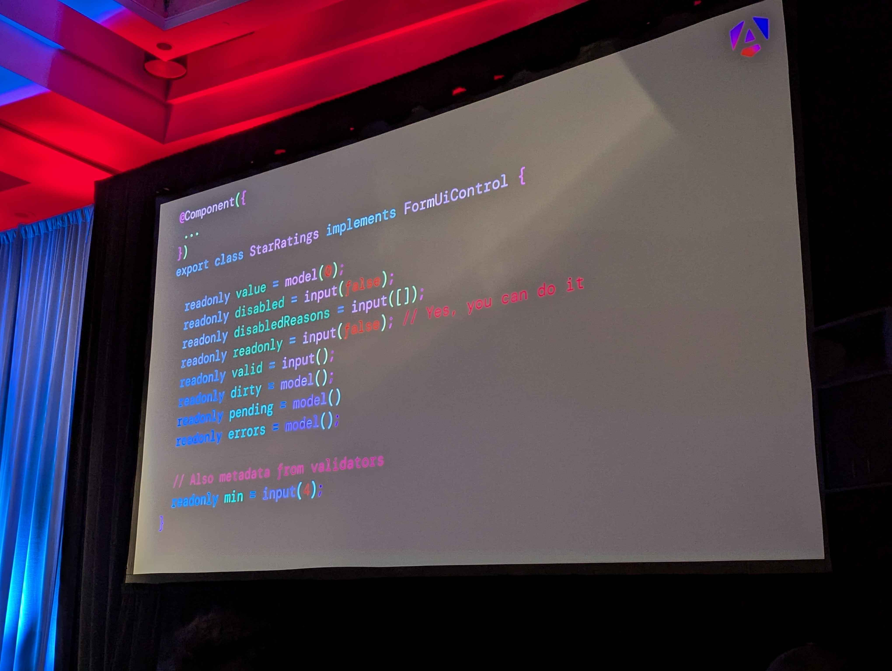
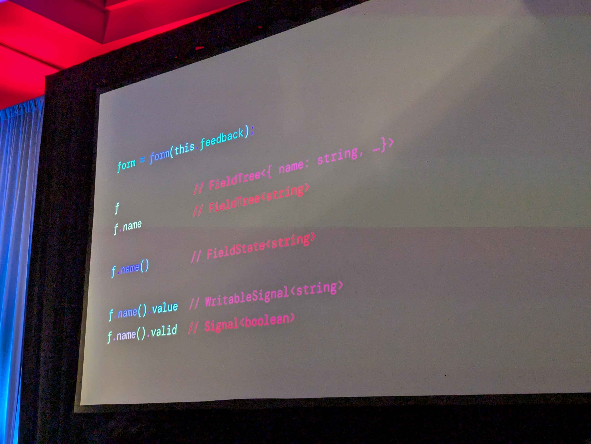
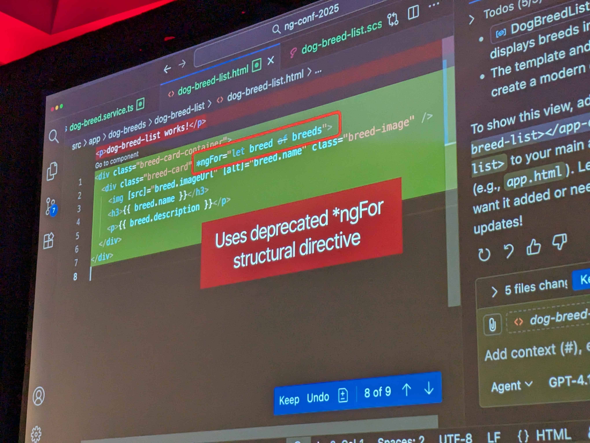
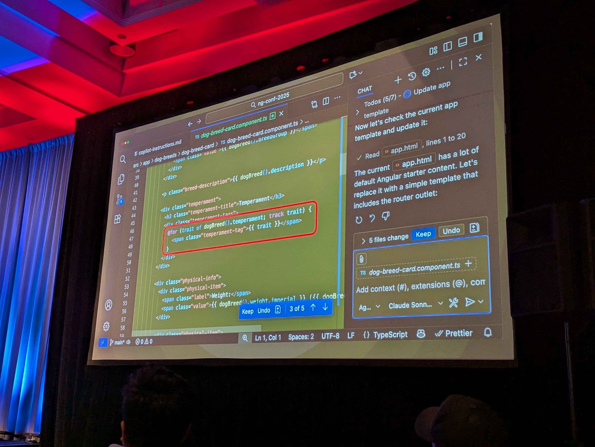
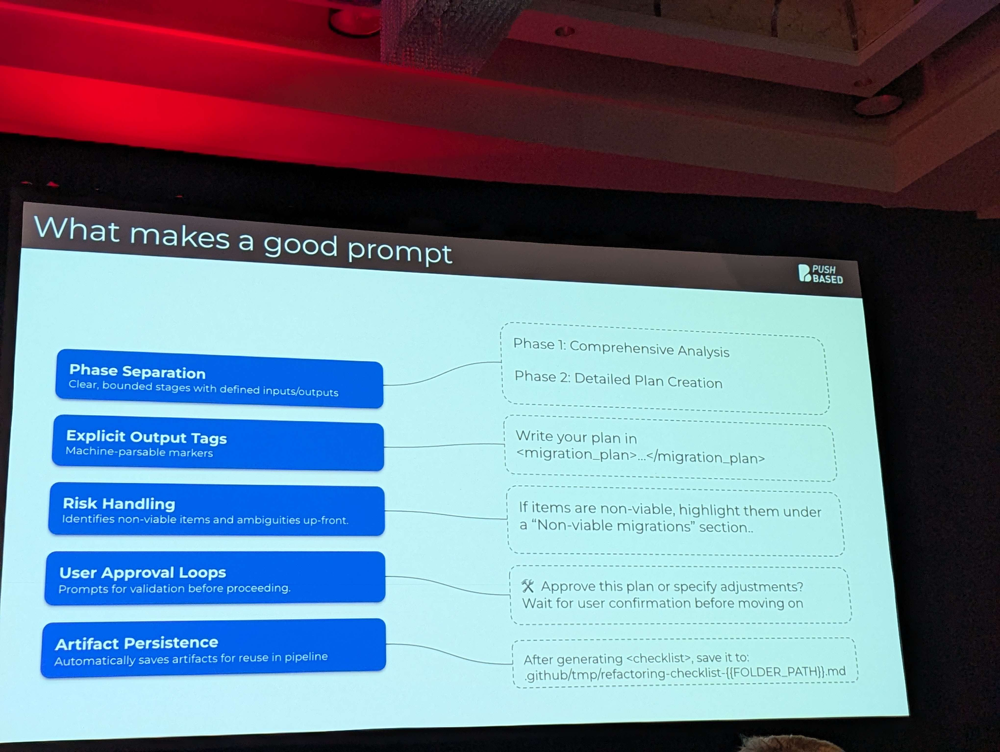
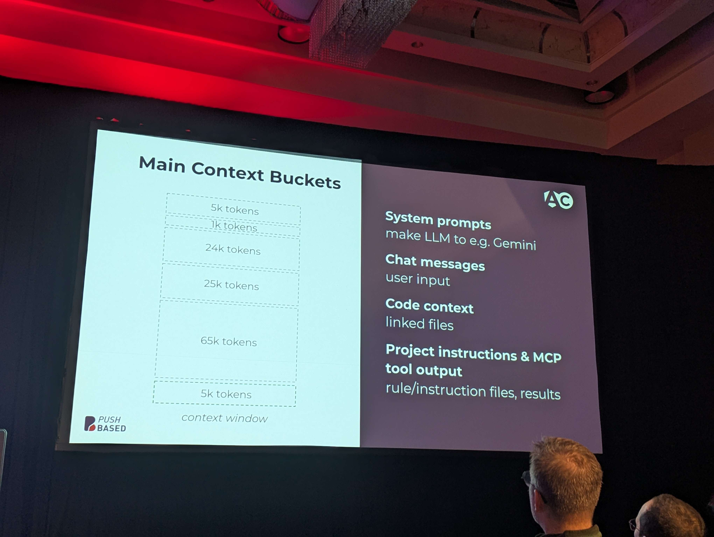
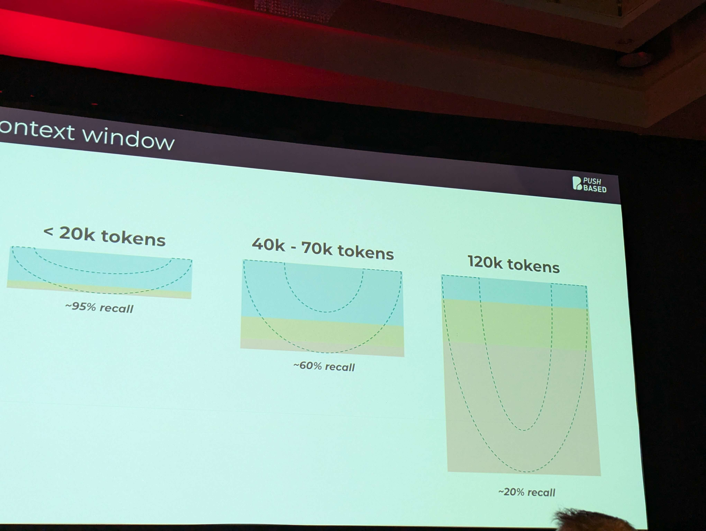

# Signal Forms 

**[Stackblitz Interactive Preview](stackblitz.com/edit/signal-forms)**
 
Will still be experimental in v21... :(

Goal - take the best parts of TemplateForms, ReactiveForms, and Signals 

## Blurry Pictures 

*Example of a signal form's fields*

*Types of each property accessible from the form*

# AI Stuff 

[Guide to NG with AI](https://angular.dev/ai/develop-with-ai)
- Includes standardized starting prompts to guide the AI in what it procudes

**Did you know?!**: This way of doing for loops is deprecated

*AI trained on old code generates things that are out of date*

@for is how modern loops should be written according to the ng folks

*AI with additional context about what makes good angular code*

You can achieve this by writing good prompts (see the NG AI link)

Be careful about ballooning context window sizes!

Large context windows are big contributors to what causes AI to generate bad code (or bad information in general). As the window gets larger, the context window loses more and more of the beginning part of the conversation and prioritizes more recent information, causing it to lose important context and instructions.
