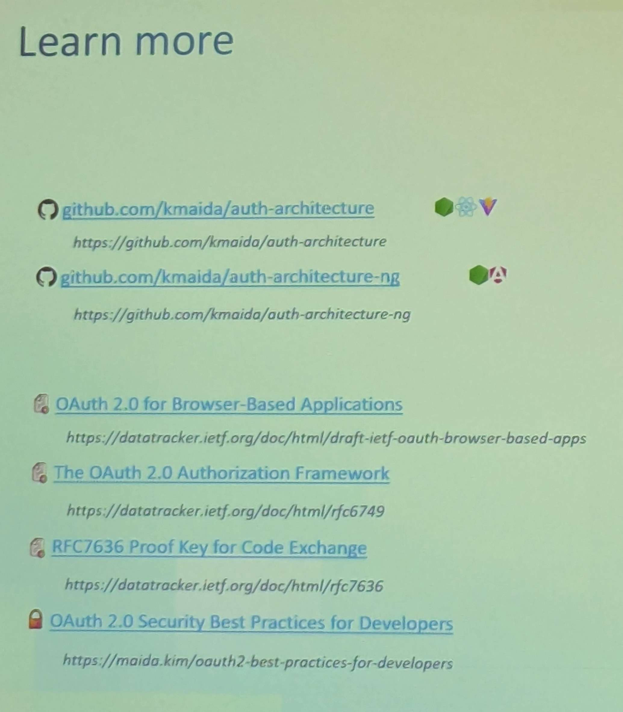
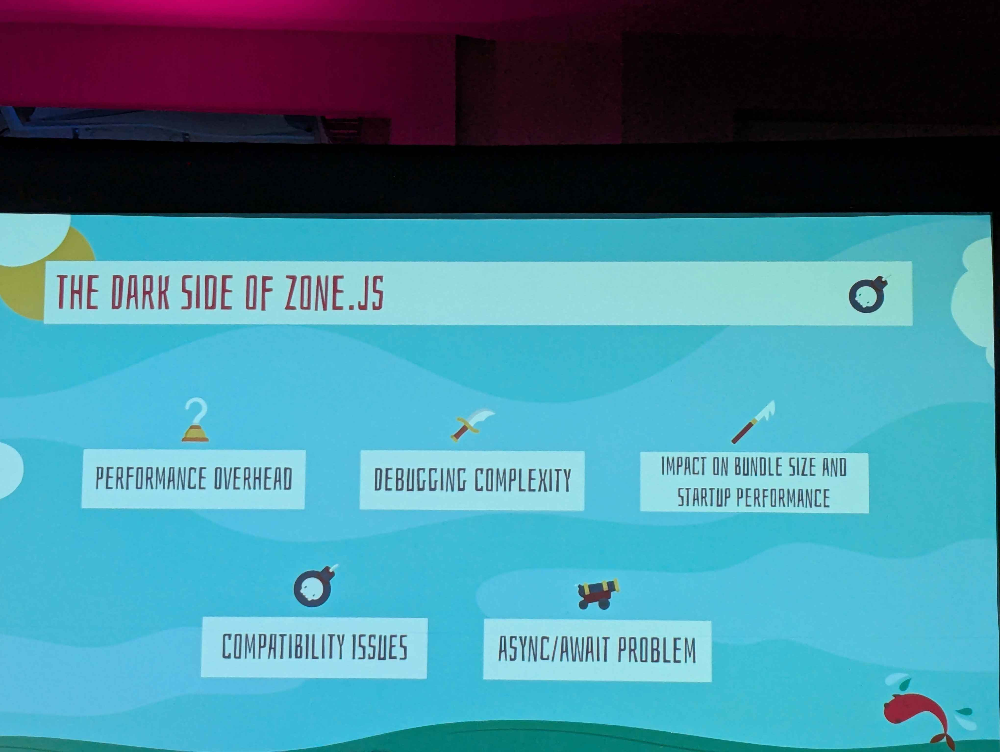

# Architecture-Driven Angular Authentication

## Backend for Frontend
- Uses PKCE 
- Access tokens generated tend to be bearer tokens, necessitating them to be managed by the intermediate backend server to avoid misuse

### Pros
- Most secure way to perform authentication for browser based applications like Angular
- Attackers cannot access tokens in the front end 

### Cons
- Complexity
  - Required knowledge of OIDC
  - Manual implementation required due to proxying  
- Cross domain requests must be proxied since cookies cannot be sent across domains

## Token Mediating Backend
- Still uses PKCE  
- Front end makes API requests to those services directly 
  - If the token is expired, the front end asks the middleman server to get a new access token 


### Pros
- Similar pros to BfF 
- Front end directly calls APIs 

### Cons 
- Complexity is similar, but don't need to proxy API requests
- **Access tokens are in the browser**, so they can potentially be viewed/intercepted by malicious actors 
  - Therefore additional security is required to be implemented

## Browser Based OAuth 2.0
- **Least secure** option for JS apps
- Must used PKCE
- Architecture should be used when authentication is used for convenience, but not security
  - Apps that can be used anonymously normally and can save trivial data
  - Refresh tokens should be single use and sessions short lived

### Pros 
- Simple
- Can be decoded in the front end to populate basic user info

### Cons
- Insecure AF, tokens are stored in app memory

## Choosing 

**BfF**
- Most secure
- Same domain APIs
- Strong Security Requirements
- Need to call other secure APIs

**TMB**
- Some APIs don't allow proxy access

**BBOC**
- Not recommended in general due to its insecurity 
  - The spec literally says you probably shouldn't use this lmao


*Authentication Resources*

[Github](https://github.com/kmaida/auth-architecture-ng)

# Reactive Thinking with Signals and the Resource API 
Note that resources are still experimental 

``` typescript
cakes = signal(['pie', 'chocolate', 'vanilla']);
selected = signal(2);
selectedCake = computed(() => this.cakes()[this.selected()])
cakeResource = createCakeResource(this.selectedCake);
details = this.cakeResource.value;
// error = this.cakeResource.error
```

## Resources 
[Example Ng Mario Code](https://github.com/manfredsteyer/mario) 
 
``` bash
git clone https://github.com/manfredsteyer/mario.git
```

[Ebook from the presenter](angulararchitects.io/modern)

# Playwright

Browser UI testing<br>
[Example from the demo](https://testronaut.dev/)

# Zoneless 


*What would you say, you DO here?*


*The pain points of using ZoneJs*

Zoneless (removing ZoneJs entirely) is the way that the Angular team is leaning towards in the future, via Signals and OnPush change detection.
- Performance improvements from not having to check the entire component tree for changes
- Easier debugging because the code isn't being proxied through ZoneJs
